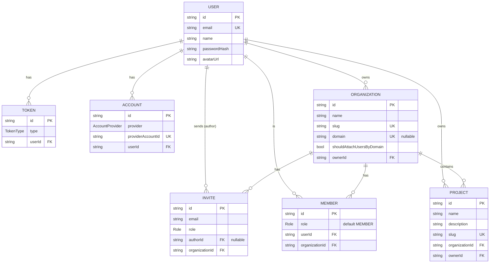

# Architecture — Domain Model

**Last updated:** 2026-05-28
**Authoritative source:** [apps/api/prisma/schema.prisma](../../apps/api/prisma/schema.prisma)

Este documento descreve o modelo de domínio: entidades, relações e regras de delete. Quando o
schema Prisma mudar, atualize **aqui** (sobrescrevendo) e referencie no spec do PR.

## ERD

## Entities

### User

Conta de usuário da plataforma. Pode autenticar via senha (`passwordHash`) e/ou OAuth
(através de `Account`). É o **owner** natural — toda Organization e todo Project tem um.

| Campo | Tipo | Nota |
|---|---|---|
| `id` | UUID | PK |
| `email` | string | **unique** — usado como identificador alternativo |
| `name` | string? | |
| `passwordHash` | string? | nullable: usuário OAuth-only não tem |
| `avatarUrl` | string? | |

### Organization (tenant)

A unidade de **tenancy** principal. Cada Organization tem um owner e zero ou mais Members.

| Campo | Tipo | Nota |
|---|---|---|
| `slug` | string | **unique** — identificador URL-friendly |
| `domain` | string? | **unique** — domínio de email pra auto-attach |
| `shouldAttachUsersByDomain` | bool | se `true`, usuários com email `@domain` viram member automaticamente |
| `ownerId` | FK → User | dono atual (transferível) |

### Project

Recurso de negócio dentro de uma Organization. Tem owner próprio (não necessariamente o owner
da Org) — útil para delegação dentro do tenant.

| Campo | Tipo | Nota |
|---|---|---|
| `slug` | string | **unique globally** (não só por Org) |
| `description` | string | obrigatório |
| `organizationId` | FK → Organization | tenant onde vive |
| `ownerId` | FK → User | dono do projeto |

### Member

Tabela de junção User ↔ Organization com **role** (RBAC). Determina o que o user pode fazer
dentro daquela Org — ver [rbac-permissions.md](rbac-permissions.md).

| Campo | Tipo | Nota |
|---|---|---|
| `role` | Role | default `MEMBER` |
| `(organizationId, userId)` | composite | **unique** — um user só tem um role por Org |

### Invite

Convite para um email entrar numa Organization com um role pré-definido. Inclui `authorId`
nullable: se o convidante for deletado, o invite sobrevive (apenas perde a referência).

| Campo | Tipo | Nota |
|---|---|---|
| `email` | string | indexed |
| `role` | Role | role que o invitado vai assumir ao aceitar |
| `authorId` | FK → User? | **nullable** — SetNull on delete |
| `(email, organizationId)` | composite | **unique** — um email só tem 1 invite ativo por Org |

### Token

Token de operação efêmera. Hoje só `PASSWORD_RECOVER`. Cascade delete do User.

### Account

Conta OAuth vinculada. Hoje só `GITHUB`. `(provider, userId)` é unique — um user só pode ter
uma conta GitHub vinculada.

## Tenancy & ownership

| Conceito | Implementação |
|---|---|
| **Tenant** | `Organization` — toda query de domínio é escopada por `organizationId` |
| **Membership** | `Member` — junção n:n entre User e Organization com `role` por relação |
| **Ownership da Org** | `Organization.ownerId` — User que detém a Org; transferível |
| **Ownership do Project** | `Project.ownerId` — pode ser qualquer User; útil para delegação |
| **Auto-attach** | `Organization.shouldAttachUsersByDomain` + `domain` — adesão automática por email corporativo |

## Delete behavior

Quando uma entidade é deletada, as FKs reagem assim:

| FK | On Delete | Rationale |
|----|-----------|-----------|
| `Token` → User | **CASCADE** | Tokens são efêmeros e específicos do user |
| `Account` → User | **CASCADE** | Sem user, conta OAuth perde sentido |
| `Invite` → Author (User) | **SET NULL** | Invite sobrevive mesmo se o convidante sair |
| `Invite` → Organization | **CASCADE** | Sem Org, invite é ruído |
| `Member` → Organization | **CASCADE** | Sem Org, membership não existe |
| `Member` → User | **CASCADE** | Sem User, membership não existe |
| `Project` → Organization | **CASCADE** | Project não vive fora de uma Org |
| `Organization` → Owner (User) | **RESTRICT** | Precisa transferir owner antes de deletar o User |
| `Project` → Owner (User) | **RESTRICT** | Precisa transferir owner antes de deletar o User |

> **Implicação prática:** deletar um User com Orgs ou Projects ativos **falha**. O fluxo
> correto é: transferir ownership → deletar User. Cascade cuida do resto (Member, Token,
> Account, Invite).

## Enums

| Enum | Valores | Próximas extensões prováveis |
|------|---------|------------------------------|
| `Role` | `ADMIN`, `MEMBER`, `BILLING` | Possíveis: `OWNER` (hoje implícito via FK), roles customizadas |
| `TokenType` | `PASSWORD_RECOVER` | `EMAIL_VERIFICATION`, `MAGIC_LINK` |
| `AccountProvider` | `GITHUB` | `GOOGLE`, `MICROSOFT` |

## Naming convention

- Tabelas no Postgres: **snake_case plural** (`users`, `organizations`, `password_hash`) via `@@map` e `@map`
- Models no Prisma: **PascalCase singular** (`User`, `Organization`)
- IDs: **UUID v4** via `@default(uuid())` — escolha sobre auto-increment para evitar enumeration attacks

## Related docs

- [rbac-permissions.md](rbac-permissions.md) — quem pode fazer o quê com cada entidade
- [../specs/2026-05-28-api-fastify-prisma-setup.md](../specs/2026-05-28-api-fastify-prisma-setup.md) — spec original (snapshot histórico)
- [apps/api/prisma/schema.prisma](../../apps/api/prisma/schema.prisma) — source of truth
