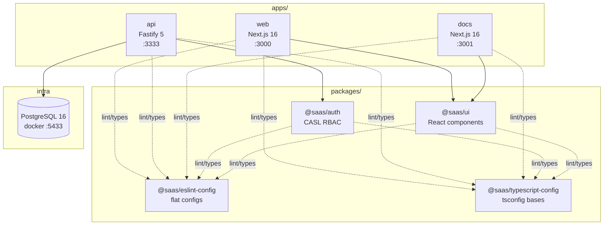

# Architecture — Monorepo Overview

**Last updated:** 2026-05-28

Este documento é o **mapa do sistema**. Para detalhes profundos de cada subsystem, siga os
links para os documentos evergreen específicos (domain, RBAC, local dev).

## System diagram



Linhas cheias = dependência runtime/import. Linhas pontilhadas = dependência de
toolchain (lint + tsconfig), não chega em runtime.

## Apps

| App | Framework | Porta | Propósito | Status |
|-----|-----------|-------|-----------|--------|
| `web` | Next.js 16.2.0 + React 19.2.0 | 3000 | Frontend principal da SaaS | Esqueleto — só dark mode wired |
| `api` | Fastify 5.4.0 + Prisma 7 | 3333 | REST API com RBAC | Health route apenas; schema completo migrado |
| `docs` | Next.js 16.2.0 + React 19.2.0 | 3001 | Reservado para docs site | Vazio — decisão pendente em [specs/2026-05-28-apps-docs-purpose.md](../specs/2026-05-28-apps-docs-purpose.md) |

**Entrypoints:**
- `web`: `next dev --port 3000` → App Router em `apps/web/app/`
- `api`: `tsx watch --env-file .env src/server.ts` → Fastify boot em `apps/api/src/server.ts`
- `docs`: `next dev --port 3001` → App Router em `apps/docs/app/`

## Packages

| Package | Export pattern | Consumidores | Build strategy |
|---------|----------------|--------------|----------------|
| `@saas/auth` | `"."`: `./src/index.ts` | `apps/api` | Source-only — sem build step |
| `@saas/ui` | `"./*"`: `./src/*.tsx` | `apps/web`, `apps/docs` | Source-only — sem build step |
| `@saas/eslint-config` | Múltiplos JS configs (base, next-js, react-internal, node) | Todos os apps + packages | Source-only |
| `@saas/typescript-config` | `base.json`, `nextjs.json`, `react-library.json` | Todos os apps + packages | Source-only |

### Por que source-only exports?

`@saas/ui` e `@saas/auth` não têm build step (nenhum `tsc`/`tsup`/`bundler`). Os consumidores
importam direto do source `.tsx`/`.ts`. **Vantagens:**

- Zero ceremony — editar e ver o efeito imediato no consumer (hot-reload do app)
- Sem cache de build pra invalidar
- TypeScript dos consumers já consegue navegar até o source (go-to-definition funciona)

**Trade-off:** o consumer precisa ter o mesmo toolchain (Next/TS) e os files precisam compilar
no contexto do consumer. Isso é OK porque todos os consumidores são internos.

### Dependências internas declaradas

Todas as dependências internas usam `"workspace:*"` no `package.json`:

```jsonc
// apps/web/package.json
"dependencies": {
  "@saas/ui": "workspace:*"
}
```

pnpm resolve via symlink durante install — sem publicação no npm.

## Turbo task graph

Configurado em [turbo.json](../../turbo.json):

| Task | dependsOn | cache | env | persistent |
|------|-----------|-------|-----|------------|
| `build` | `^build` | ✅ | (via `.env*` inputs) | ❌ |
| `lint` | `^lint` | ✅ | — | ❌ |
| `check-types` | `^check-types`, `db:generate` | ✅ | — | ❌ |
| `dev` | — | ❌ | `DATABASE_URL`, `PORT`, `NODE_ENV` | ✅ |
| `db:generate` | — | ❌ | — | ❌ |
| `db:migrate` | — | ❌ | `DATABASE_URL` | ❌ |

**Pontos importantes:**

- **`check-types` depende de `db:generate`** — o Prisma client é gerado antes do TypeScript
  conseguir tipar `apps/api`. Isso roda no CI também ([commit 45a1194](https://github.com/pedrosouza423/next-saas-rbac/commit/45a1194)).
- **`dev` é `persistent: true` + `cache: false`** — Turbo entende que é um long-running watcher.
- **`db:generate` e `db:migrate` são `cache: false`** — operações idempotentes que não dependem
  só dos inputs.

### Filtrar por app

```powershell
pnpm --filter=web dev          # só o web
pnpm --filter=api db:migrate   # só o api
pnpm --filter=web... build     # web + suas dependências internas
```

## Global conventions

### Package scope `@saas/*`

Todos os packages internos usam o scope `@saas/`. O template Turborepo original usava `@repo/`;
renomeamos para evitar confusão com forks futuros. Apps mantêm nomes curtos sem scope
(`web`, `api`, `docs`) porque não são publicáveis.

### ESLint flat config + zero warnings

- Todos os packages usam **flat config** (`eslint.config.js`, não `.eslintrc`)
- Scripts de lint sempre rodam com `--max-warnings 0`
- `eslint-plugin-only-warn` está em `@saas/eslint-config/base` — converte todos os errors em
  warnings; combinado com `--max-warnings 0`, ainda falha o CI mas dá um output mais legível
- `turbo/no-undeclared-env-vars` enforça que toda env var lida via `process.env` está
  declarada em `turbo.json` (`env` ou `passThroughEnv`)

### TypeScript

- Apps Next.js usam `next typegen && tsc --noEmit` para gerar tipos de rota antes do check
- `@saas/typescript-config/base.json` — strict + ES2022 + NodeNext
- `@saas/typescript-config/nextjs.json` — extends base + ESNext + Bundler resolution + JSX preserve

### Prettier

Único `format` script na raiz cobre tudo: `prettier --write "**/*.{ts,tsx,css,md}"`.
Não há prettier scripts por package — root é autoridade.

## Related docs

- [domain-model.md](domain-model.md) — entidades, ERD, relações
- [rbac-permissions.md](rbac-permissions.md) — matriz CASL completa
- [local-development.md](local-development.md) — setup, env vars, comandos
- [../CHANGELOG.md](../CHANGELOG.md) — histórico de mudanças significativas
- [../../CLAUDE.md](../../CLAUDE.md) — pointer operacional para agentes
